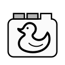

# CloseTabs Extension

CloseTabs Extension is a Safari extension that removes old
tabs and reduces the clutter in Safari.

Please visit the CloseTabs Extension website for more information.

This Jekyll site is derived from the [Reverie Template](https://github.com/amitmerchant1990/reverie/blob/master/_config.yml).
