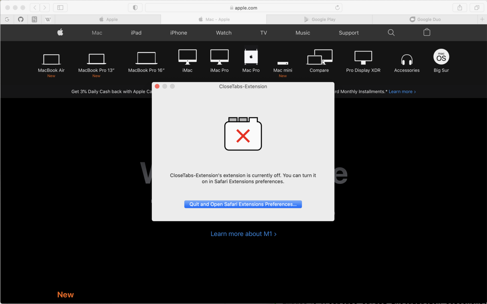

### Download the CloseTabs Extension Application from the App Store

The download link is currently TBD.

### Run the CloseTabs extension and click the Install

Click the Install the CloseTabs Safari Extension...

### Enable the extension in Safari

1. Open Safari
1. Click the `Safari` menu
1. Select `Preferences`
1. Go to the `Extensions` tab
1. Make sure the CloseTabs Extension is clicked on the left side.

### Configure your extension

1. Click on the CloseTabs icon in the toolbar.
1. `Minimum Tabs` specifies the minimum number of tabs to never be removed.
1. `Minimum Idle Time` specifies the minimum time from the last time the tab was viewed before it is removed.
1. `Reset to Defaults` resets the timers to reasonable defaults.

